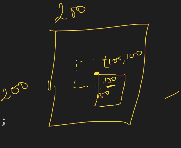
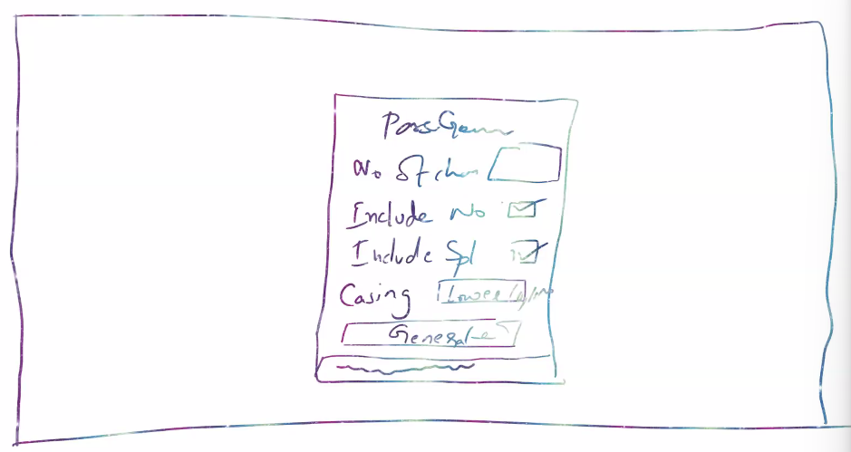

> Color palletes:
- https:#coolors.co/
- https:#colorhunt.co/

> React uses Pascal case component casing.
Component casing types:
1. PasingCase
2. snake_case 
3. kebab-case 
4. camelCase 

> Why should we use fragment instead of div, when div is not required?
div takes additional memory than <>, when theres no need to use div, but you just want to use a container, use fragments instead 

instead of <> we can event write <React.Fragment></React.Fragment>

> how to center align a  div using styling? 

- Transform: translate(-50%, -50%);
- top:50% and left:50%

> How do we declare a root variable in css?
```bash
# define the scope within which it s available 
:root{
    --dark-blue: #3D5A80;
    --light-blue: #98C1D9;
}

body{
    background-color: var(--dark-blue, yellow);
    # if it doesnt find dark blue, it shows the fallback variable instead, in this case its yellow
```
> What are hooks? What's the use of useState hook?
Hooks are special functions which helps you hook into the application. eg: useState, useCallback, useEffect.

useState used to give state functionality to your app. components data is tracked through state. 

> understand `Math.ceil`, `Math.random` 
```bash
Math.random -> [0, 1)
#return a random number from 0 to 1, 0 inclusive, 1 excluded 

#What does this statement mean?
Math.floor(Math.random() * chars.length)
# while Math.random() generates any number between 0 and 1 (1 excluded) 

# if we have Math.random[0, 5) then we'd have to do this Math.random() * 4, since Math.random[) only takes 0 and values btw 0 and 1, so it will generate these values 

#        0  1  2  3  4 
chars = [0, 1, 2, 3, 4]
last index = 4 
length = 5 

#Math.random() can generate any number between 0 and n (except n)
#over here were discussing different possibilities, 
#Note that: all of these calculations doesnt happen on one iteration itself 
Math.random()  | Math.random() * chars.length  | Math.floor(Math.random() * chars.length)
0              | 0 * 5   = 0                   | 0
0.1            | 0.1 * 5 = 0.5                 | 0
0.2            | 0.2 * 5 = 1.0                 | 1
0.3            | 0.3 * 5 = 1.5                 | 1
0.4            | 0.4 * 5 = 2.0                 | 2
0.5            | 0.5 * 5 = 2.5                 | 2
0.6            | 0.6 * 5 = 3.0                 | 3
0.7            | 0.7 * 5 = 3.5                 | 3
0.8            | 0.8 * 5 = 4.0                 | 4
0.9            | 0.9 * 5 = 4.5                 | 4
# Math.random() * chars.length returns any number btw 0 and n 

# if we want [0, 7) then Math.random() * 8
# from this we an defer that [0, n) will give Math.floor(Math.random() * chars.length)
# where last index = n and char.length = n+1

let pass = "";
for(let i = 0; i < charCount; i++) {
    const index = Math.floor(Math.random() * chars.length);
    const singleChar = chars.charAt(index);
    #charAt converts the numeric number value to its corresponding ASCII value 
    pass = pass + singleChar;
}

```
### Password Generator 
1. creating a wireframe (How website should look / feel) This is to create a rough sketch to refer to while were coding. Like a rough sketch of how it looks, one step before UI design.


2. code out the basic template 
> PassGen.js 
```bash
const PassGen = () => {
    return (
    <div className="container">
      <h2 className="title">Password Generator</h2>

      
      <ConfigurationOptions />
      <br />
      <button className="action_btn">Generate</button>
      <p className="op_pass">ABCD</p>
    </div>
    )
}
```
> Configuration.options.js 
```bash
const ConfigurationOptions = (props) => {
  const [charCount, setCharCount] = React.useState(0);
  const [incNumber, setIncNumber] = React.useState(false);
  const [incSplChars, setIncSplChars] = React.useState(false);
  const [casing, setCasing] = React.useState("");

    # if we wanted to do using a common state, we can use this approach 
    # const[config, setConfig] = React.useState({
    #     number: 0, 
    #     splChar: false,
    #     casing: ""
    # })

    return (
        # div takes additional memory than <>, when theres no need to use div, but you just want to use a container, use fragments instead 

        # instead of <> we can event write <React.Fragment></React.Fragment>
        <>
             {/* for and id must match */}
    <div>
        <label htmlFor="no_of_chars">Number of Characters</label>
        <input type="number" id="no_of_chars" className="f-right" onKeyUp={e => setCharCount(e.target.value)} />
      </div>

      <div>
        <label htmlFor="include_numbers">Include Number</label>
        <input type="checkbox" id="include_numbers" className="f-right" onChange={e => setIncNumber(e.target.checked)} />
      </div>

      <div>
        <label htmlFor="include_spl_chars">Include Special Characters</label>
        <input type="checkbox" id="include_spl_chars" className="f-right" onChange={e => setIncSplChars(e.target.checked)} />
      </div>

      <div>
        <label htmlFor="casing">Casing</label>
        <select id="casing" className="f-right" onChange={e => setCasing(e.target.value)}>
          <option disabled selected>Select Casing</option>
          <option value="lower">Lowercase</option>
          <option value="upper">Uppercase</option>
          <option value="mixed">Mixedcase</option>
        </select>
      </div>

       
        </>
    )
}
```
> What is state lifting?
Child component `configurationoptions` contains state, we want to use this state in the parent component. we can acheive it by passing props from child component to parent component using callback approach, but that would become too complicated. Use the callback approach when we have to lift only specific states from the child component, in this case we would have to lift all child states, so to prevent the complications, we keep the states in the parent component itself.
```bash
     parent 
     /   \
  child1 child2 
         (state)

# how would we get the state from child2 into child1?
# thats why we place the states in the parent, so both the sibling components can access states directly from the parent component. 
```
3. We place the state in the parent level, also remove it from the child component. 
we transfer the state from child component to parent component, because we want to use it here 
> PassGen.js 
```bash
const PassGen = () => {
  # well pass these 8 props from parent -> child compoennt
  const [charCount, setCharCount] = React.useState(0);
  const [incNumber, setIncNumber] = React.useState(false);
  const [incSplChars, setIncSplChars] = React.useState(false);
  const [casing, setCasing] = React.useState("");

    return (
    <div className="container">
      <h2 className="title">Password Generator</h2>

    # since we only need to access the set functions from the child component, were commenting out the others
      <ConfigurationOptions 
        # charCount={charCount} 
        setCharCount={setCharCount}
        # incNumber={incNumber}
        setIncNumber={setIncNumber}
        # incSplChars={incSplChars}
        setIncSplChars={setIncSplChars}
        # casing={casing}
        setCasing={setCasing}
      />

      <br />
      <button className="action_btn">Generate</button>
      <p className="op_pass">ABCD</p>
    </div>
    )
}
```
> ConfigurationOptions.js 
```bash
const ConfigurationOptions = (props) => {
    return (
        <>
    <div>
        <label htmlFor="no_of_chars">Number of Characters</label>
        <input type="number" id="no_of_chars" className="f-right" onKeyUp={e => 
          props.setCharCount(e.target.value)} />
      </div>

      <div>
        <label htmlFor="include_numbers">Include Number</label>
        <input type="checkbox" id="include_numbers" className="f-right" onChange={e => 
          props.setIncNumber(e.target.checked)} />
      </div>

      <div>
        <label htmlFor="include_spl_chars">Include Special Characters</label>
        <input type="checkbox" id="include_spl_chars" className="f-right" onChange={e => 
          props.setIncSplChars(e.target.checked)} />
      </div>

      <div>
        <label htmlFor="casing">Casing</label>
        <select id="casing" className="f-right" onChange={e => 
          props.setCasing(e.target.value)}>
          <option disabled selected>Select Casing</option>
          <option value="lower">Lowercase</option>
          <option value="upper">Uppercase</option>
          <option value="mixed">Mixedcase</option>
        </select>
      </div>

       
        </>
    )
}
```
4. Now we'll add the generate button, which is responsible for generating a random pass based on the criteria given in the `configurationOptions`
```bash
                    Container                #parent 
                    /       \
ConfigurationOptions.js    GenerateButton.js #child 
(set the state)            (use the state)
```
> PassGen.js 
```bash
const PassGen = () => {
  # well pass these 8 props from parent -> child compoennt
  const [charCount, setCharCount] = React.useState(0);
  const [incNumber, setIncNumber] = React.useState(false);
  const [incSplChars, setIncSplChars] = React.useState(false);
  const [casing, setCasing] = React.useState("");


    return (
    <div className="container">
      <h2 className="title">Password Generator</h2>

    {/* passing props from parent to child  */}
    {/* since we only need to access the set functions from the child component, were commenting out the others */}
      <ConfigurationOptions 
        # charCount={charCount} 
        setCharCount={setCharCount}
        # incNumber={incNumber}
        setIncNumber={setIncNumber}
        # incSplChars={incSplChars}
        setIncSplChars={setIncSplChars}
        # casing={casing}
        setCasing={setCasing}
      />

      <br />

      {/* passing props from parent to child  */}
      <GenerateButton 
        charCount={charCount} 
        incNumber={incNumber}
        incSplChars={incSplChars}
        casing={casing}
      />
      <p className="op_pass">ABCD</p>
    </div>
    )
}
```
> ConfigurationOptions.js 
```bash
const ConfigurationOptions = (props) => {
    return (
        <>
    <div>
        <label htmlFor="no_of_chars">Number of Characters</label>
        <input type="number" id="no_of_chars" className="f-right" onKeyUp={e => 
          props.setCharCount(e.target.value)} />
      </div>

      <div>
        <label htmlFor="include_numbers">Include Number</label>
        <input type="checkbox" id="include_numbers" className="f-right" onChange={e => 
          props.setIncNumber(e.target.checked)} />
      </div>

      <div>
        <label htmlFor="include_spl_chars">Include Special Characters</label>
        <input type="checkbox" id="include_spl_chars" className="f-right" onChange={e => 
          props.setIncSplChars(e.target.checked)} />
      </div>

      <div>
        <label htmlFor="casing">Casing</label>
        <select id="casing" className="f-right" onChange={e => 
          props.setCasing(e.target.value)}>
          <option disabled selected>Select Casing</option>
          <option value="lower">Lowercase</option>
          <option value="upper">Uppercase</option>
          <option value="mixed">Mixedcase</option>
        </select>
      </div>
        </>
    )
}
```
> GenerateButton.js 
```bash
const GenerateButton = (props) => {
    const generatePass = () => {
        console.log(props.charCount, props.incNumber, props.incSplChars, props.casing)

    }
    return (
        <>
        <button className='action_btn'
        onClick={generatePass}
        >Generate</button>
        </>
    )
}
```
5. complete `generatePass` function inside GenerateButton.js 
```bash
const GenerateButton = (props) => {
    const [pass, setPass] = React.useState("")

    const generatePass = () => {
        console.log(props.charCount, props.incNumber, props.incSplChars, props.casing)

        let chars = ""

        switch(props.casing) {
            case 'lower':
                chars = ['abcdefghijklmnopqrstuvwxyz']
                break;
            case 'upper':
                chars= ['ABCDEFGHIJKLMNOPQRSTUVWXYZ']
                break;
            case 'mixed':
                chars = ['abcdefghijklmnopqrstuvwxyzABCDEFGHIJKLMNOPQRSTUVWXYZ']
                break;
            default:
                chars = ['abcdefghijklmnopqrstuvwxyz']
                break;
        }

        if(props.incNumber){
            chars = chars + '1234567890' 
        }

        if(props.incSplChars){
            chars = chars + '_&*+@#$%'
        }
        console.log(chars)

        # minimum = 1 
        # maximum = 16
        let charCount = props.charCount

        #it cannot be more than 16 or less than 1
        #for example, if user enters a value more than 16, it will generate 16 characters only, 

        # however if user enters a value less than 16, it will assign those many values 
        if(charCount > 16){
            charCount = 16
        }
        if(charCount < 1){
            charCount = 1
        }

        let password = ""
        for(let i=0; i<charCount; i++){
            # generate random number between 0 and n 
            const index = Math.floor(Math.random() * chars.length)
            #chars is initially an empty string, we insert random number that is g
            const singleChar = chars.charAt[index]
            #generate index of random characters when user clicks on generate 
            #chars.charAt[index] generates the alphabet corresponding to the number generated 
            password = password + singleChar
        }
        console.log(password)
        setPass(password)

    }
    return (
        <>
        <button className='action_btn' onClick={generatePass}>Generate</button>
        # <p className="op_pass">{pass}</p> 

        # if state is empty it means we havent entered num of chars thats why its not going to enter the for loop and it wil contain the default pass state which is empty string thats why it will show false  
        {pass !== "" ?  <p className="op_pass">{pass}</p> : <p>false</p>}
        </>
    )
}
```
> Whats happening in the code?
- PassGen (parent) - contains all the states which are passed to its children`ConfigurationOptions` and `GenerateButton`. Note that: initially these states were defined inside `ConfigurationOptions` but since we wanted the states to be shared with the other child as well, we lifted the state and added it in the parent component instead 
- inside `ConfigurationOptions`were retreiving the `setstate` props passed by parent and updating the state with the value user entered. 
- inside `GenerateButton` were retreiving the `state` props passed by the parent and passing it through  a function `generatePass` when user clicks on the button we'll call this function.

### The code structure 
> PassGen.js 
```bash
#parent
const PassGen = () => {
  const [charCount, setCharCount] = React.useState(0);
  const [incNumber, setIncNumber] = React.useState(false);
  const [incSplChars, setIncSplChars] = React.useState(false);
  const [casing, setCasing] = React.useState("");


  return (
    <div className="container">
      <h2 className="title">Password Generator</h2>
      <ConfigurationOptions 
        setCharCount={setCharCount}  
        setIncNumber={setIncNumber} 
        setIncSplChars={setIncSplChars}
        setCasing={setCasing}
      />
      <br />
      <GenerateButton 
        charCount={charCount} 
        incNumber={incNumber} 
        incSplChars={incSplChars} 
        casing={casing}
      />
    </div>
  )
}
```
> ConfigurationOptions.js 
```bash
const ConfigurationOptions = (props) => {

  return(
    <>
      <div>
        <label htmlFor="no_of_chars">Number of Characters</label>
        <input type="number" id="no_of_chars" className="f-right" onKeyUp={e => props.setCharCount(e.target.value)} />
      </div>

      <div>
        <label htmlFor="include_numbers">Include Number</label>
        <input type="checkbox" id="include_numbers" className="f-right" onChange={e => props.setIncNumber(e.target.checked)} />
      </div>

      <div>
        <label htmlFor="include_spl_chars">Include Special Characters</label>
        <input type="checkbox" id="include_spl_chars" className="f-right" onChange={e => props.setIncSplChars(e.target.checked)} />
      </div>

      <div>
        <label htmlFor="casing">Casing</label>
        <select defaultValue="" id="casing" className="f-right" onChange={e => props.setCasing(e.target.value)}>
          <option disabled value="">Select Casing</option>
          <option value="lower">Lowercase</option>
          <option value="upper">Uppercase</option>
          <option value="mixed">Mixedcase</option>
        </select>
      </div>
    </>
  )
}
```
> GenerateButton.js
```bash
const GenerateButton = (props) => {
    const [password, setPassword] = React.useState("");
  
    const generatePassword = () => {
      let chars = "";
      switch(props.casing) {
        case "lower":
          chars = "abcdefghijklmnopqrstuvwxyz";
          break;
        case "upper":
          chars = "ABCDEFGHIJKLMNOPQRSTUVWXYZ";
          break;
        case "mixed":
          chars = "abcdefghijklmnopqrstuvwxyzABCDEFGHIJKLMNOPQRSTUVWXYZ";
          break;
        default:
          chars = "abcdefghijklmnopqrstuvwxyz";
          break;
      }
  
      if(props.incNumber) {
        chars = chars + "1234567890";
      }
      if(props.incSplChars) {
        chars = chars + "_&*+@!#$%";
      }
  
      let charCount = props.charCount;
      if(charCount > 16) { charCount = 16; }
      if(charCount < 1)  { charCount = 1;  }
  
      let pass = "";
      for(let i = 0; i < charCount; i++) {
        const index = Math.floor(Math.random() * chars.length);
        console.log('index', index)
        const singleChar = chars.charAt(index);
        console.log('singlechar', singleChar)
        pass = pass + singleChar;
      }
      setPassword(pass);    
    }
    return(
      <>
        <button className="action_btn" onClick={generatePassword}>Generate</button>
        {password !== "" ? <p className="op_pass">{password}</p> : false }
      </>
    )
  }
```


 